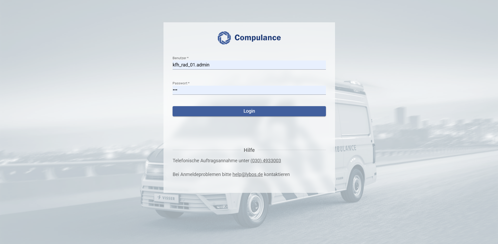
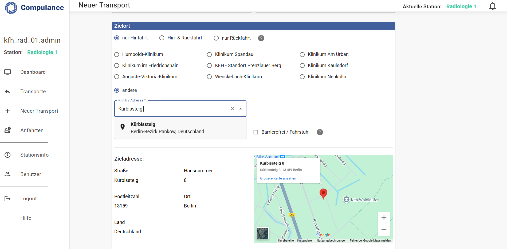
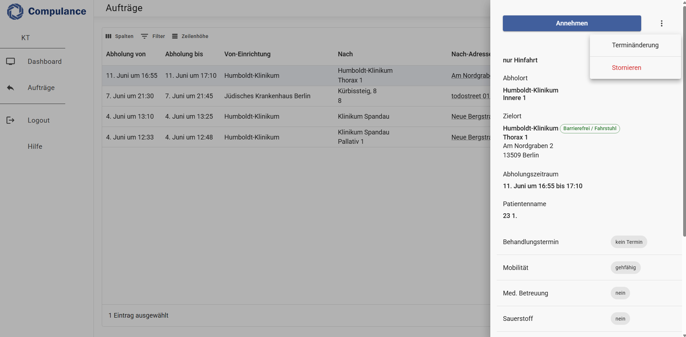
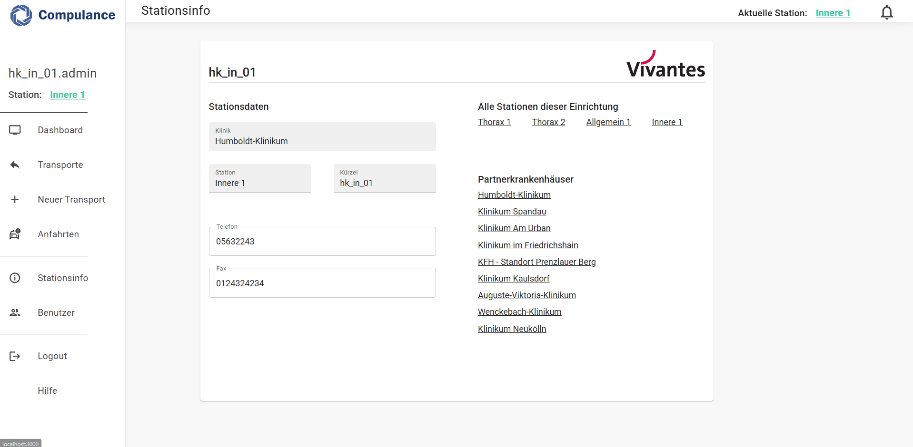
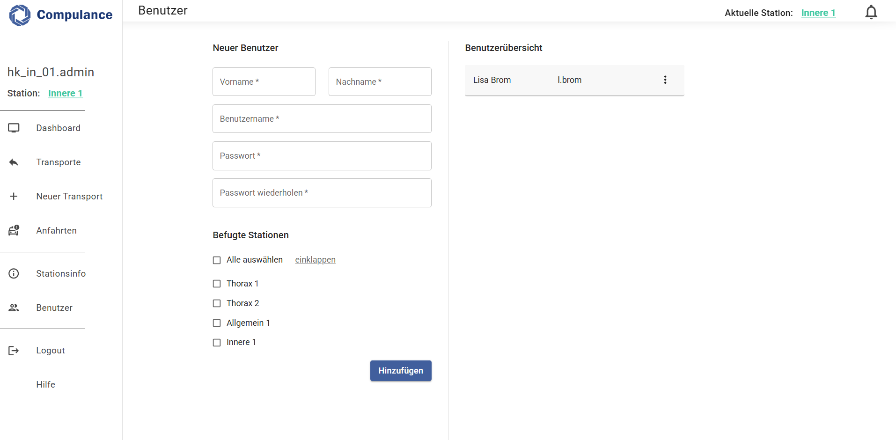

# cpl-web
Compulance Web - Digitale Auftragserfassung für Krankentransporte und Kliniken

---

## JWT-basierte Authentifizierung 

---

## Benutzerfreundliche Auftragserstellung mit Adressvervollständigung 

---

## Übersichtliche Auftragsannahme 

---

## Rollenbasierter Zugriff 

---

## Nutzerverwaltungssystem 

---

## Technologie-Stack

- **Frontend:** React
- **Backend:** Node.js
- **Datenbank:** MongoDB
- **Karten-Engine:** Google Places API

---